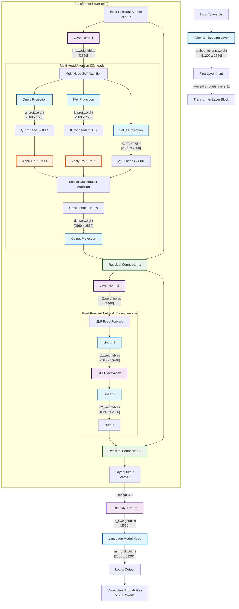

# Phi-2 Mechanistic Interpretability with TDA

Complete mechanistic interpretability analysis of Microsoft's Phi-2 language model using Topological Data Analysis (TDA). This project provides both local and remote analysis workflows, with efficient HuggingFace-first pipelines for scalable analysis.

## Quick Start

### Prerequisites
- Python 3.10+
- [uv](https://docs.astral.sh/uv/) for package management
- 8GB+ RAM (16GB+ recommended for full analysis)

### Installation
```bash
# Clone and setup
git clone <your-repo>
cd phi2-tda

# Install dependencies with uv
uv sync
```

### Project Structure
```
phi2-tda/
├── phi2_tda.py                 # Main launcher script
├── README.md                   # This file
├── RESEARCH_FINDINGS.txt       # Research summary
├── utils.py                    # Core utility functions
├── scripts/                    # Local analysis pipeline
│   ├── 00_download.py          # Model loading & weight extraction
│   ├── 01_extract.py           # Point cloud preparation
│   └── 02_tda.py               # Persistent homology computation
├── config/                     # Configuration & remote workflows
│   ├── config_remote.py        # Configuration management
│   ├── hf_data_loader.py       # HuggingFace data loading
│   └── hf_workflows.py         # Streaming analysis pipelines
├── analysis/                   # Analysis workflows
│   └── remote_analysis.py      # Remote analysis CLI
├── notebooks/                  # Jupyter notebooks
│   └── 03_viz.ipynb           # Visualization & analysis
└── pyproject.toml              # Project dependencies
```

### Choose Your Workflow

#### Option 1: Remote Analysis (Recommended)
Analyze without storing large files locally:
```bash
# Demo workflow (~100MB cache)
uv run python phi2_tda.py remote --demo

# Analyze specific layer (~200MB cache)
uv run python phi2_tda.py remote --layer 0

# Compare all strata (~500MB cache)
uv run python phi2_tda.py remote --strata

# Memory-efficient TDA (~50MB cache)
uv run python phi2_tda.py remote --tda embedding --max-points 500
```

#### Option 2: Local Analysis
Full pipeline with local storage:
```bash
# Step 1: Download and extract Phi-2 weights (~5-10 minutes, 5GB)
uv run python phi2_tda.py local download

# Step 2: Prepare point clouds for TDA (~2-3 minutes)
uv run python phi2_tda.py local extract

# Step 3: Compute persistent homology (~5-15 minutes)
uv run python phi2_tda.py local tda

# Step 4: Visualize results
jupyter notebook notebooks/03_viz.ipynb
```

#### Option 3: MLP Reconstruction
Reconstruct all 32 trained MLPs from weights:
```bash
# Requires downloaded weights from Option 2, Step 1
uv run python phi2_tda.py local reconstruct-mlps --num-layers 32
```

#### Direct Script Access
You can also run scripts directly:
```bash
# Remote analysis
uv run python analysis/remote_analysis.py --demo

# Local pipeline
uv run python scripts/00_download.py
uv run python scripts/01_extract.py
uv run python scripts/02_tda.py

# MLP reconstruction
uv run python mlp_reconstructor.py
```

## 📋 Core Components

### Main Launcher
- **`phi2_tda.py`** - Unified command-line interface for all workflows

### Local Analysis Pipeline (`scripts/`)
- **`00_download.py`** - Model loading and weight extraction
- **`01_extract.py`** - Point cloud preparation
- **`02_tda.py`** - Persistent homology computation

### Remote Analysis Infrastructure (`config/`)
- **`hf_data_loader.py`** - Remote data loading with intelligent caching
- **`hf_workflows.py`** - Streaming analysis pipelines
- **`config_remote.py`** - Configuration management for remote vs local

### Analysis Workflows (`analysis/`)
- **`remote_analysis.py`** - HuggingFace-first analysis CLI

### Visualization (`notebooks/`)
- **`03_viz.ipynb`** - Interactive visualization and analysis

### Core Utilities
- **`utils.py`** - Helper functions and memory management

## 🔗 Remote Analysis Workflows

### Configuration Management
```python
from config.config_remote import use_remote_data, use_minimal_resources

# Switch to remote data (default)
config = use_remote_data("totalorganfailure/phi2-weights")

# Use minimal resources for constrained environments
config = use_minimal_resources()
```

### Data Loading
```python
from config.hf_data_loader import HFDataLoader

# Initialize remote loader
loader = HFDataLoader("totalorganfailure/phi2-weights")

# Load specific weight matrix
with loader.get_weights_file() as f:
    q_matrix = f['Q_0'][:]

# Load point cloud
pc_data = loader.load_point_cloud("embedding")
```

### Streaming Analysis
```python
from config.hf_workflows import StreamingAnalyzer, quick_layer_analysis

# Memory-efficient layer analysis
analyzer = StreamingAnalyzer()
result = analyzer.analyze_layer_range(0, 5)  # Layers 0-4

# Quick single layer analysis
layer_result = quick_layer_analysis(0)
```

## 📊 Command Reference

### Main Launcher Commands
```bash
# Remote analysis
uv run python phi2_tda.py remote --demo
uv run python phi2_tda.py remote --layer 5 --output results/
uv run python phi2_tda.py remote --batch 0 10 --output results/
uv run python phi2_tda.py remote --strata --output results/
uv run python phi2_tda.py remote --tda Q_stratum --max-points 1000

# Local analysis
uv run python phi2_tda.py local download --model microsoft/phi-2
uv run python phi2_tda.py local extract --max-points 10000
uv run python phi2_tda.py local tda --output custom_results/
uv run python phi2_tda.py local reconstruct-mlps --num-layers 32
```

### Direct Script Commands
```bash
# Remote analysis scripts
uv run python analysis/remote_analysis.py --demo
uv run python analysis/remote_analysis.py --layer 5

# Local analysis scripts
uv run python scripts/00_download.py --model microsoft/phi-2
uv run python scripts/01_extract.py --max-points 10000
uv run python scripts/02_tda.py --output-dir custom_results/
uv run python mlp_reconstructor.py --input phi2_weights.h5 --output mlp_reconstructions/
```

## 🧠 Key Concepts

### Latent-Space Strata
The analysis organizes Phi-2 weights into topological strata:

- **Embedding Stratum**: Token embeddings (8,000 points × 25D)
- **Attention Strata**: Query (Q), Key (K), Value (V), Output (O) projections (12,000 points × 30D each)
- **MLP Strata**: Feed-forward layers FF1/FF2 (15,000 points × 35D each)

### Topological Features
- **β₀ (Connected Components)**: Number of disconnected clusters in weight space
- **β₁ (Loops)**: Number of 1-dimensional holes/cycles
- **Persistence**: Lifespan of topological features across scales

### Memory Management
The remote workflows automatically manage memory:
- **Streaming**: Loads only required data
- **Caching**: Intelligent temporary storage
- **Cleanup**: Automatic resource cleanup
- **Batching**: Processes data in manageable chunks

## 🎯 Expected Results

### Typical Findings from Phi-2 Analysis
- **β₀ = 7**: One connected component per stratum
- **β₁ = 0**: No persistent loops (tree-like structure)
- **Dimensionality**: 2560D → ~30D effective dimension

### Key Insights
- **K_stratum**: Most compressed (30D → 27D, 0.90 ratio)
- **Q_stratum**: Highly structured (30D → 28D, 0.93 ratio)
- **V_stratum & O_stratum**: Least compressed (0.97 ratio)
- **FF2_stratum**: Highest H₁ feature count (47,485 finite bars)

## ⚙️ Configuration

### Memory Settings
```python
# Minimal resources (8GB RAM)
config = use_minimal_resources()  # 200MB cache, 1000 points

# Standard (16GB RAM)
config = use_remote_data()        # 1GB cache, 5000 points

# Local (32GB+ RAM)
config = use_local_data()         # No cache limit, 15000 points
```

### Analysis Parameters
```python
# Point cloud settings
max_points_per_stratum = 5000
pca_components = 10
tda_max_points = 1000

# TDA settings
max_dimension = 1
enable_cleanup = True
```

## 📁 Output Structure

### Remote Analysis
```
results/
├── layer_0_analysis.json          # Single layer analysis
├── layers_0_to_10_analysis.json   # Batch layer analysis
├── all_strata_comparison.json     # Stratum comparison
└── embedding_tda_analysis.json    # TDA results
```

### Local Analysis
```
phi2-tda/
├── phi2_weights.h5                 # Extracted model weights (5GB)
├── point_clouds/                   # Normalized point clouds
│   ├── Q_stratum.npz
│   ├── K_stratum.npz
│   └── ...
├── tda_results/                    # TDA analysis results
│   ├── persistence_diagrams.pkl
│   ├── betti_analysis.json
│   └── *.png (visualizations)
└── 03_viz.ipynb                    # Analysis notebook
```

## 🔧 Configuration Examples

### Layer-wise Analysis
```python
# Analyze specific layer
result = quick_layer_analysis(layer_id=0)

# Batch analyze multiple layers
analyzer = StreamingAnalyzer()
batch_result = analyzer.analyze_layer_range(0, 10)
```

### Stratum Comparison
```python
# Compare attention mechanisms
strata = ["Q_stratum", "K_stratum", "V_stratum", "O_stratum"]
comparison = comparative_stratum_analysis(strata)

# Access results
for stratum in strata:
    pca_result = comparison['pca_analysis']['results'][stratum]
    print(f"{stratum}: {pca_result['explained_variance_ratio'][:3]}")
```

### Memory-Efficient TDA
```python
# Run TDA on subsampled data
tda_result = memory_efficient_tda("embedding", max_points=1000)
print(f"β₀: {tda_result['beta_0']}, β₁: {tda_result['beta_1']}")
```

## 📊 HuggingFace Dataset

The analysis results are available at: https://huggingface.co/datasets/totalorganfailure/phi2-weights

### Complete Data Schema



#### **phi2_weights.h5** (5GB) - Raw Weight Matrices
```
Total matrices: 257 (organized by layer and component)
├── Q_0 to Q_31: Query projections (2560, 2560) - "What am I looking for?"
├── K_0 to K_31: Key projections (2560, 2560) - "What information do I contain?"
├── V_0 to V_31: Value projections (2560, 2560) - "What should I pass along?"
├── O_0 to O_31: Output projections (2560, 2560) - "How do I combine attention?"
├── FF1_0 to FF1_31: MLP expansion (10240, 2560) - "Expand for processing"
├── FF2_0 to FF2_31: MLP contraction (2560, 10240) - "Contract back to residual"
└── embed: Token embeddings (51200, 2560) - "Vocabulary → hidden states"
```

#### **weight_summary.csv** - Statistical Analysis
```
Rows: 193 (one per weight matrix)
Columns:
├── Matrix: Weight matrix name (e.g., "Q_0", "FF1_15")
├── Stratum: Functional grouping (Q, K, V, O, FF1, FF2, embedding)
├── Layer: Transformer layer number (0-31, NaN for embedding)
├── Shape: Matrix dimensions as string
├── Parameters: Total parameter count
├── Mean: Average weight value
├── Std: Standard deviation of weights
├── Min: Minimum weight value
├── Max: Maximum weight value
└── Sparsity: Fraction of near-zero weights
```

#### **point_clouds/*.npz** - Processed Point Clouds for TDA
```
7 strata, each containing normalized weight vectors:
├── embedding: (8000, 25) - Token embedding vectors
├── Q_stratum: (12000, 30) - Query weight vectors from all layers
├── K_stratum: (12000, 30) - Key weight vectors from all layers  
├── V_stratum: (12000, 30) - Value weight vectors from all layers
├── O_stratum: (12000, 30) - Output weight vectors from all layers
├── FF1_stratum: (15000, 35) - MLP expansion vectors from all layers
└── FF2_stratum: (15000, 35) - MLP contraction vectors from all layers

Each .npz file contains:
├── points: L2-normalized weight vectors (float32)
├── original_dim: Original dimensionality before PCA
├── reduced_dim: Reduced dimensionality after PCA
└── metadata: Processing parameters
```

#### **analysis_stats.json** - Analysis Metadata
```json
{
  "analysis_date": "2025-07-18",
  "model": "microsoft/phi-2",
  "parameters": "2.7B",
  "layers": 32,
  "hidden_size": 2560,
  "files_organized": 32,
  "total_size_gb": 4.9,
  "strata_analyzed": 7
}
```

### Data Interpretation Guide

#### **Weight Matrix Shapes**
- **Square matrices (2560×2560)**: Attention transformations within hidden space
- **Rectangular matrices (10240×2560)**: MLP expansion to 4× intermediate size
- **Embedding matrix (51200×2560)**: Maps 51,200 vocabulary tokens to hidden states

#### **Point Cloud Properties**
- **Normalization**: All vectors L2-normalized to unit length
- **Dimensionality**: PCA-reduced from 2560D to 25-35D effective dimensions
- **Sampling**: Subsampled for computational efficiency while preserving structure
- **Value ranges**: Typically [-1, 1] due to normalization

#### **Stratum Statistics**
- **K_stratum**: Most compressed (σ=0.071) - highly structured attention keys
- **Q_stratum**: Well-structured (σ=0.066) - organized query patterns
- **V_stratum**: Moderate structure (σ=0.039) - flexible value representations
- **O_stratum**: Least variation (σ=0.028) - consistent output projections
- **FF1_stratum**: High variation (σ=0.040) - diverse expansion patterns
- **FF2_stratum**: Low variation (σ=0.019) - consistent contraction patterns
- **embedding**: Moderate variation (σ=0.052) - balanced token representations

### Loading Examples

```python
# Load specific weight matrix
with loader.get_weights_file() as f:
    q_layer_0 = f['Q_0'][:]  # Shape: (2560, 2560)

# Load point cloud
embedding_pc = loader.load_point_cloud("embedding")
points = embedding_pc['points']  # Shape: (8000, 25)

# Load summary statistics
summary = loader.load_summary_data()
ff1_stats = summary[summary['Stratum'] == 'FF1']
```

## 🐛 Troubleshooting

### Memory Issues
```bash
# Use minimal configuration
python remote_analysis.py --tda embedding --max-points 500

# Or switch to minimal resources
python -c "from config_remote import use_minimal_resources; use_minimal_resources()"
```

### Network Issues
```bash
# Check HuggingFace connectivity
python -c "from hf_data_loader import HFDataLoader; loader = HFDataLoader(); print(loader.list_available_files())"
```

### Performance Optimization
- Use `--max-points` parameter to limit memory usage
- Enable cleanup with `cleanup_after_analysis=True`
- Use batch processing for multiple layers
- Monitor memory usage with built-in warnings

## 📚 Key Papers & References

- "Topological Data Analysis for Neural Network Interpretability"
- "Persistent Homology in Machine Learning"
- "Mechanistic Interpretability with Topological Methods"
- Microsoft Phi-2 Model Paper

