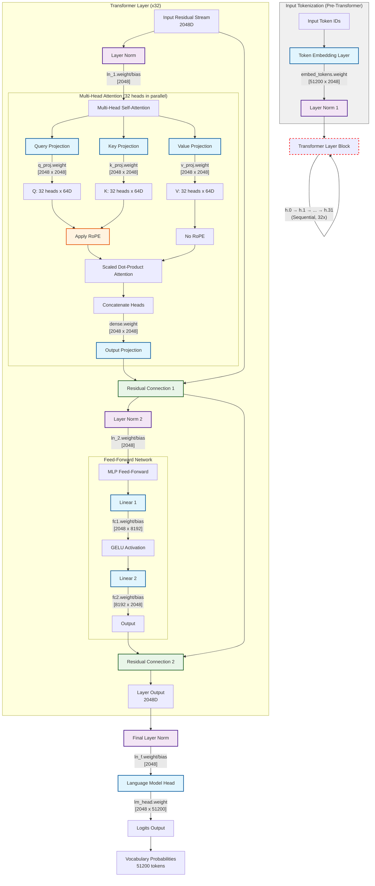

# Phi-2 Mechanistic Interpretability with TDA

Mechanistic interpretability analysis of Microsoft's Phi-2 language model

### Remote Analysis

```bash
uv run python phi2_tda.py remote 
```

## Local Analysis
```bash
uv run python phi2_tda.py local [command]

jupyter notebook notebooks/03_viz.ipynb
```

## MLP Reconstruction
```bash
uv run python phi2_tda.py local reconstruct-mlps --num-layers 32
```

### Scripts 
```bash
# remote
uv run python analysis/remote_analysis.py --demo

# local
uv run python scripts/00_download.py
uv run python scripts/01_extract.py
uv run python scripts/02_tda.py

# mlp reconstruction
uv run python mlp_reconstructor.py
```

## Ideas

### Latent Strata

Idea: Phi-2 weights can be organized into topological strata:

- **Embedding Stratum**: Token embeddings (8,000 points × 25D)
- **Attention Strata**: Query (Q), Key (K), Value (V), Output (O) projections (12,000 points × 30D each)
- **MLP Strata**: Feed-forward layers FF1/FF2 (15,000 points × 35D each)

### Topological Features
- **β₀ (Connected Components)**: Number of disconnected clusters in weight space
- **β₁ (Loops)**: Number of 1-dimensional holes/cycles
- **Persistence**: Lifespan of topological features across scales

## HuggingFace Dataset

https://huggingface.co/datasets/totalorganfailure/phi2-weights

### Model Architecture and Data Schema



#### **phi2_weights.h5** raw weights
```
Total matrices: 257 (organized by layer and component)
├── Q_0 to Q_31: Query projections (2560, 2560) - "What am I looking for?"
├── K_0 to K_31: Key projections (2560, 2560) - "What information do I contain?"
├── V_0 to V_31: Value projections (2560, 2560) - "What should I pass along?"
├── O_0 to O_31: Output projections (2560, 2560) - "How do I combine attention?"
├── FF1_0 to FF1_31: MLP expansion (10240, 2560) - "Expand for processing"
├── FF2_0 to FF2_31: MLP contraction (2560, 10240) - "Contract back to residual"
└── embed: Token embeddings (51200, 2560) - "Vocabulary → hidden states"
```

#### **weight_summary.csv**
```
Rows: 193 (one per weight matrix)
Columns:
├── Matrix: Weight matrix name (e.g., "Q_0", "FF1_15")
├── Stratum: Functional grouping (Q, K, V, O, FF1, FF2, embedding)
├── Layer: Transformer layer number (0-31, NaN for embedding)
├── Shape: Matrix dimensions as string
├── Parameters: Total parameter count
├── Mean: Average weight value
├── Std: Standard deviation of weights
├── Min: Minimum weight value
├── Max: Maximum weight value
└── Sparsity: Fraction of near-zero weights
```

#### **point_clouds/*.npz** - Processed Point Clouds for TDA
```
7 strata, each containing normalized weight vectors:
├── embedding: (8000, 25) - Token embedding vectors
├── Q_stratum: (12000, 30) - Query weight vectors from all layers
├── K_stratum: (12000, 30) - Key weight vectors from all layers  
├── V_stratum: (12000, 30) - Value weight vectors from all layers
├── O_stratum: (12000, 30) - Output weight vectors from all layers
├── FF1_stratum: (15000, 35) - MLP expansion vectors from all layers
└── FF2_stratum: (15000, 35) - MLP contraction vectors from all layers

Each .npz file contains:
├── points: L2-normalized weight vectors (float32)
├── original_dim: Original dimensionality before PCA
├── reduced_dim: Reduced dimensionality after PCA
└── metadata: Processing parameters
```

#### **analysis_stats.json** (metadata)
```json
{
  "analysis_date": "2025-07-18",
  "model": "microsoft/phi-2",
  "parameters": "2.7B",
  "layers": 32,
  "hidden_size": 2560,
  "files_organized": 32,
  "total_size_gb": 4.9,
  "strata_analyzed": 7
}
```

### Loading Examples

```python
# specific weight matrix
with loader.get_weights_file() as f:
    q_layer_0 = f['Q_0'][:]  # Shape: (2560, 2560)

# point cloud
embedding_pc = loader.load_point_cloud("embedding")
points = embedding_pc['points']  # Shape: (8000, 25)

# summary statistics
summary = loader.load_summary_data()
ff1_stats = summary[summary['Stratum'] == 'FF1']
```

## References

- "Topological Data Analysis for Neural Network Interpretability"
- "Persistent Homology in Machine Learning"
- "Mechanistic Interpretability with Topological Methods"
- Microsoft Phi-2 Model Paper


